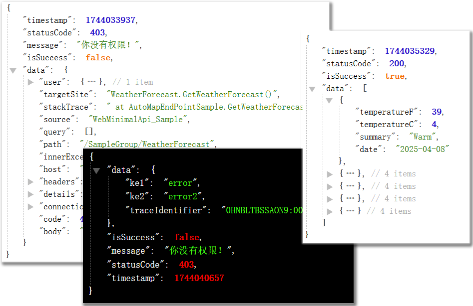

## 内建自动注册端点以及统一返回值和Exception格式的Minimal API项目模板



### 统一返回格式结果的方法：
> * 直接创建[`ResultMode<T>`](https://github.com/ls0001/MinimalApiAutoMapTempalte/blob/main/WebMinimalApi_Salmple/Underpinings/ApiResult/ResultModel.cs)的实例。
> * 通过工厂类[`ResultModel`](https://github.com/ls0001/MinimalApiAutoMapTempalte/blob/main/WebMinimalApi_Salmple/Underpinings/ApiResult/ResultModel.cs)提供的一系列的工厂方法来创建统一返回结果的实例。
> * 通过端点自动映射，并将`IsAutoWarpResult`设置为`True`，端点的返回结果便会被自动包装到统一结果类型。

#### ResultMode类包含以下工厂方法：
* #### `HasExists`：
  返回提示结果：*"The data doesn't exist"*。

* #### `NotExists`：
  返回提示结果：*"The data already exists"*。

* #### `Success<T>(string? msg = null, T? data = default)`
   返回一个表示成功的结果。
  `T`:要返回的数据类型，
  `msg`:提示内容文本，
  `data`:要返回的数据

* #### `Result(Task<bool> success)`
  根据传入的`Task`结果，返回 `Success`,或 `Failed`的结果

* #### `Result(bool success)`
  根据传入的`bool`结果，返回 `Success`,或 `Failed`的结果

* #### `Failed<T>(string? error= null, int? code = _failedCode, T? data = default)`
  返回一个表示失败的结果。
  `T`:包含错误明细的数据类型
  `error`:错误的提示文本，
  `code`:错误代码，
  `data`:错误的明细内容

* #### `SuccessAsync<T>(string? msg, Task<T> dataFactory)`
  返回一个成功结果。
  `T`:要返回的数据类型，
  `dataFactory`:要返回数据的委托
  
  <br>
------
### 自动注册端点映射的使用方法

- [X] **注册服务**：

* 注册实现了IAutoMapEndpoints接口的类型（这些类提供了需要映射的端点实际方法和端点配置）

  ```C#
  builder.Services.AddAutoMapEndPoints();
  ```

- [X] 应用自动端点映射

  ```C#
  app.MapEndPoints();       
  ```
- [X] 在提供端点方法的类上实现IAutoMapEndpoints接口：

  ```C#
  //在这里提供类内所有需要映射的端点方法配置，为每个端点创建一个EndpointMapInfo实例。
  public EndpointMapInfo[] GetEndpointsMapInfo ()=> [
      new EndpointMapInfo()
      {
          //必须参数：路由pattern
          Pattern=nameof(AutoMapEndPointSample),
          //必须参数：被映射到端点的方法
          Handler =GetWeatherForecast,
          //可选：返回的数据类弄
          ResponseTypeMetadata= new ProducesResponseTypeMetadata(200, typeof(IResultModel<WeatherForecast>), [])
      }        
      //从配置文件获取其它可选配置       
      .WithConfig(           
          _config.GetSection(               
              //指定在配置文件中的路径               
              "EndPoints:WeatherForeCast"           
              )
      ),    
  ];                                                 
  ```
  
- [ ] 可以在appsettings.json配置文件中使用以下配置节来指定各种可选配置

  ```json
      "EndPoints":
      {
          //对应上面WithConfig()方法的配置路径
          "WeatherForeCast":       
          {           
              //路由前缀           
              "Group": "SampleGroup",           
              //要应用的Http方法，如果不配置则默认为Post           
              "HttpMethods":           
              [               
                  "Get",               
                  "Post"           
              ],           
              //路由，如果配置则覆盖已在GetEndpointsMapInfo()方法中提供的值           
              "Pattern": "WeatherForecast",           
              "Name": null,           
              "Summary": "天气预报",           
              "Description": "天气预报描述",           
              "DisplayName": "天气预报显示名称",           
              "Tags": ["示例Tags"],           
              "IsAutoWarpResult":false       
          }
      }   
  ```
  </br>
------
### 启用统一异常返回结果格式的方法：

- [X] **注册服务**：

* 注册系统异常处理程序

  ```C#
   builder.Services.AddExceptionHandler<SystemExceptionHandle>();       
  ```
* 注册自定义异常处理程序

  ```C#
  builder.Services.AddExceptionHandler<CustomExceptionHandler>();       
  ```
* 注册异常处理程序相关的服务

  ```C#
  builder.Services.AddProblemDetails();         
  ```

- [X] **应用异常处理**

  ```C#
  app.UseExceptionHandler();       
  ```
  </br>

  ----------------------

### [更多详情请戳这里: [我的博客园地址]](https://www.cnblogs.com/ls0001) 

### [点击链接加入群聊【.net 开发设计】](https://qm.qq.com/q/3i8TPnB9Nu)